*NOTE:* This file is a template that you can use to create the README for your project. The *TODO* comments below will highlight the information you should be sure to include.

# Your Project Title Here

*TODO:* Write a short introduction to your project.  
This project aims to predict churn rate for a customer. Both autoML and hyperparamter tuning will be used
to train this data set. Only the model with better accuracy will be deployed. 

## Dataset

### Overview
*TODO*: Explain about the data you are using and where you got it from.  
This dataset is randomly collected from an Iranian telecom company’s database over a period of 12 months. A total of 3150 rows of data, each representing a customer, bear information for 13 columns. The attributes that are in this dataset
are call failures, frequency of SMS, number of complaints, number of distinct calls, subscription length, age group, the charge amount, type of service, seconds of use, status, frequency of use, and Customer Value.

All of the attributes except for attribute churn is the aggregated data of the first 9 months. The churn labels are the state of the customers at the end of 12 months. The three months is the designated planning gap.

Data can be download using this url: https://archive.ics.uci.edu/ml/machine-learning-databases/00592/Churn_Dateset.csv.

### Task
*TODO*: Explain the task you are going to be solving with this dataset and the features you will be using for it.  
I am going to build a classification model using feature age, Systolic Blood Pressure as SystolicBP, Diastolic BP as DiastolicBP, Blood Sugar as BS, Body Temperature as BodyTemp, HeartRate and RiskLevel. 
to predict is a woman is in high risk of getting maternal mortality.

### Access
*TODO*: Explain how you are accessing the data in your workspace.  
The data set has been uploaded to the workspace and registered used key "Churn". 
This data can be accessed using below code.  
*Figure 1-1: Access Data*
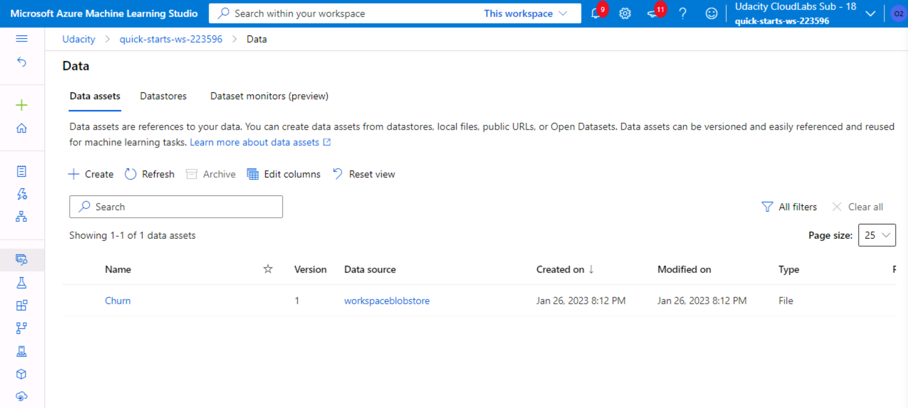
  
*Figure 1-2: Access Data*
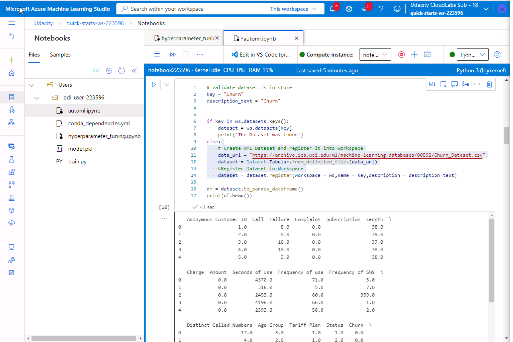
  

## Automated ML
*TODO*: Give an overview of the `automl` settings and configuration you used for this experiment  
The automl settings and configuraiton can be found in below figure.    
*Figure 2: Automl settings*
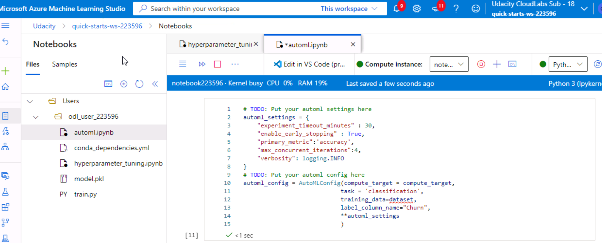

### Results
*TODO*: What are the results you got with your automated ML model? What were the parameters of the model? How could you have improved it?

*TODO* Remeber to provide screenshots of the `RunDetails` widget as well as a screenshot of the best model trained with it's parameters.  

The best automodel is a voting ensemble model with an accuracy of 0.9581. 
We can add a k-fold cross validation in the automl settings to improve the model accuracy.

Below figure shows the results of automl model.    
*Figure 3: Training results*
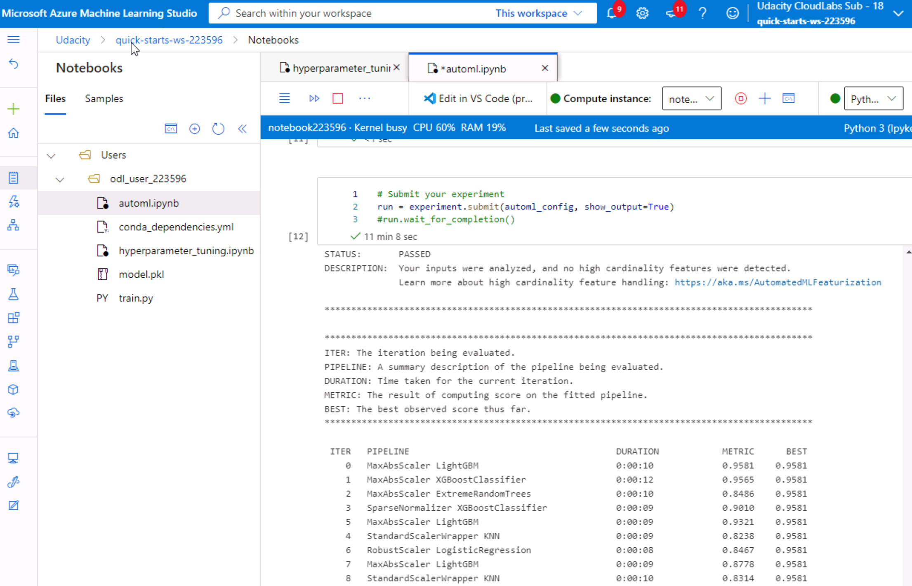
  
Below figure shows the the run details of the automl model.    
*Figure 4: Run details*
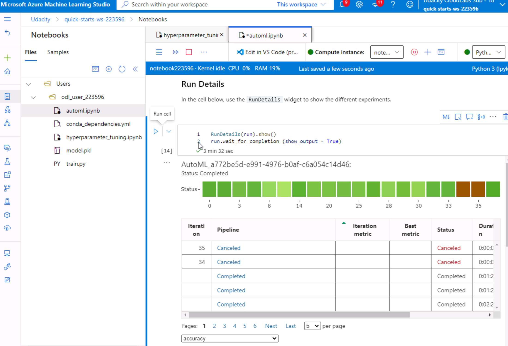
  
Below figure shows the best automl model.    
*Figure 5-1: Best automl model*
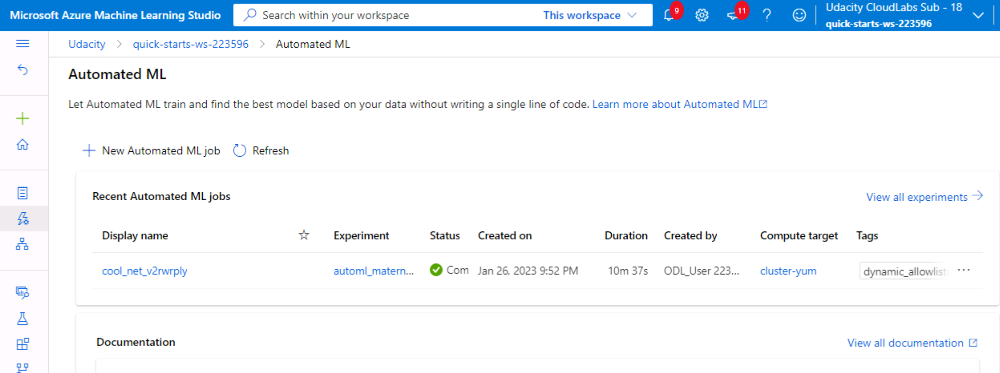
  
Below figure shows the the run details of the automl model.    
*Figure 5-2: Best automl model*
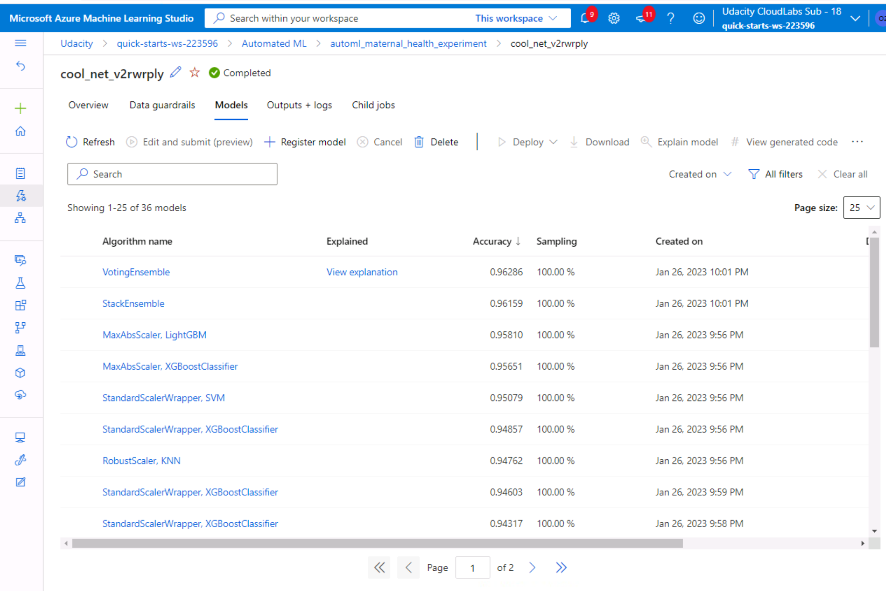
  
Below figure shows the parameters of the best automl model.    
*Figure 6: Best automl model parameters*
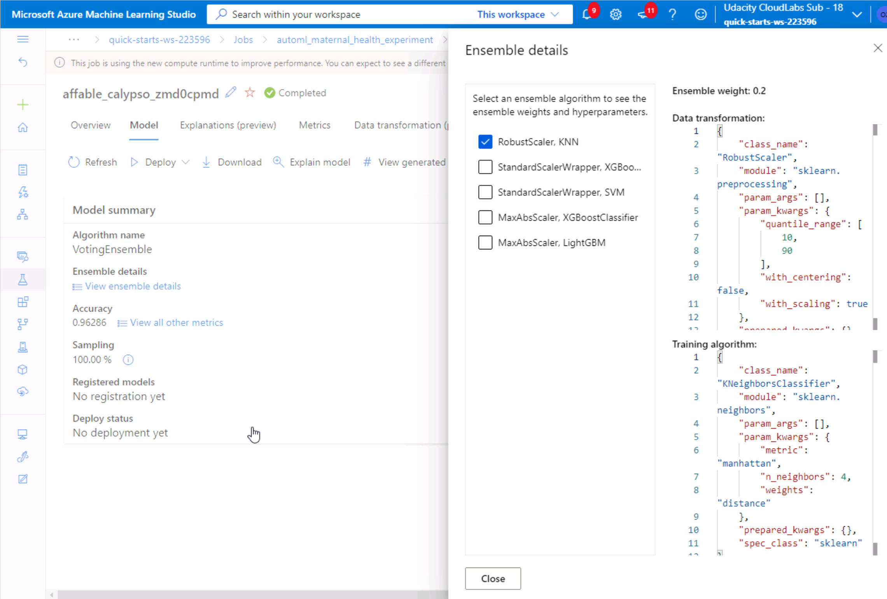
  

## Hyperparameter Tuning
*TODO*: What kind of model did you choose for this experiment and why? Give an overview of the types of parameters and their ranges used for the hyperparameter search.  
A Logistic Regression was used for this classification problem. 
Parameters C and max_iter are selected to be optimized. 
The option of the hyperparameters are (0.1, 1, 5) for C and (25, 50, 100, 200, 500) for max_iter. 
  
*Figure 7: Hyperparameter settings*
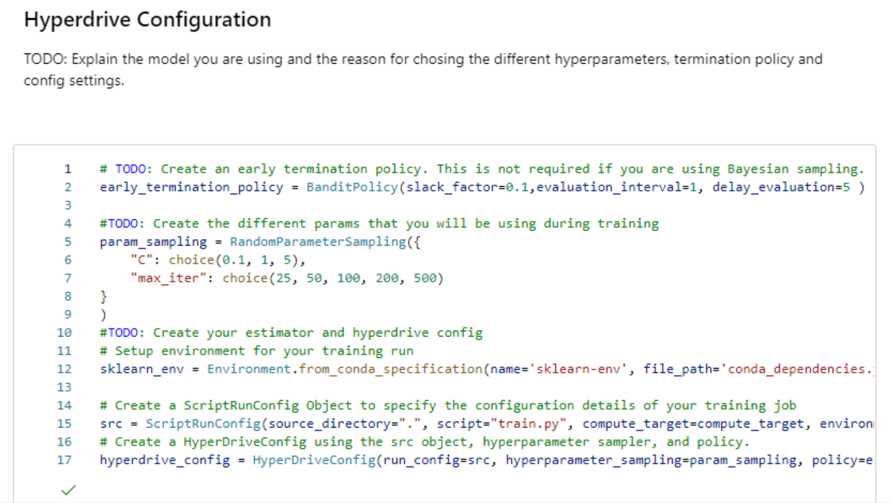
  

### Results
*TODO*: What are the results you got with your model? What were the parameters of the model? How could you have improved it?

*TODO* Remeber to provide screenshots of the `RunDetails` widget as well as a screenshot of the best model trained with it's parameters.  
The best model has an accuracy of 0.8670886 with C as 0.1 and max_iter as 500 the best. A wider range of C and max_iter could be used to improve the model accuracy.
  
*Figure 8: Hyperparameter tuning run details*
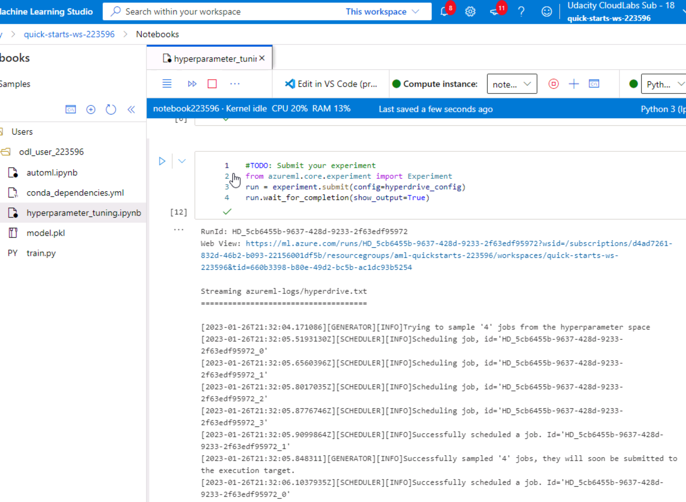
  
*Figure 9: Hyperparameter tuning results*
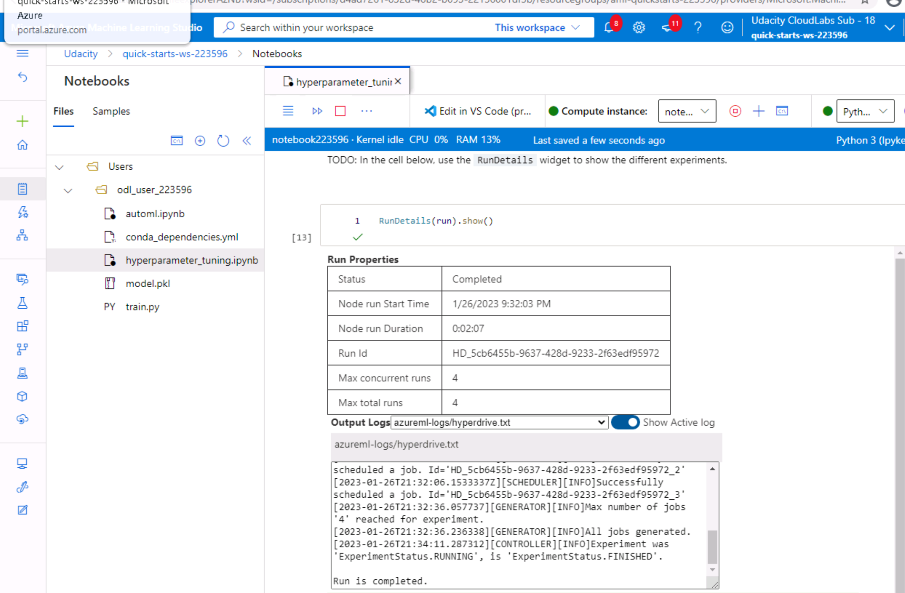
  
*Figure 10: Hyperparameter tuning best model*
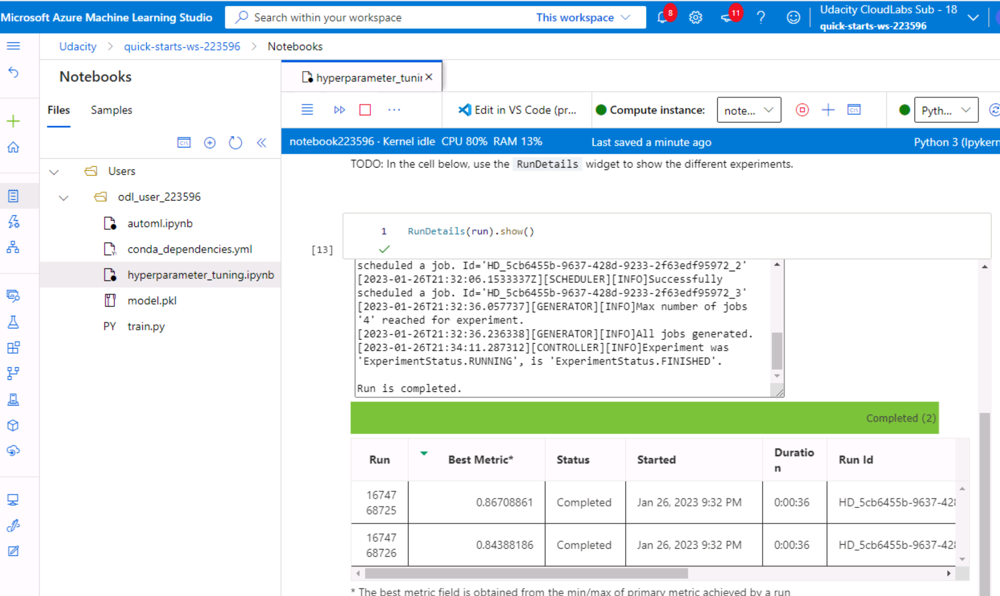
  
*Figure 11: Hyperparameter tuning best model*
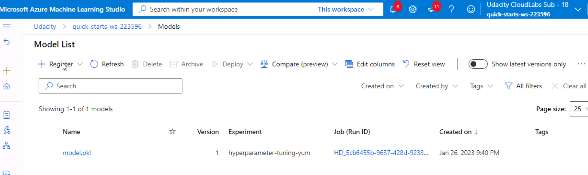
  
*Figure 12: Hyperparameter tuning best model parameters*
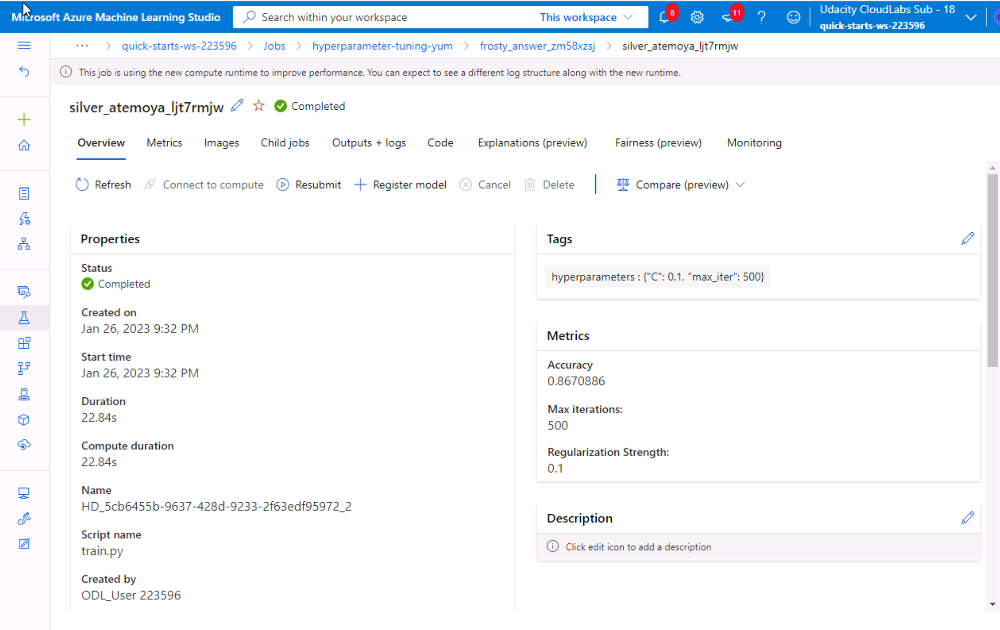
  

## Model Deployment
*TODO*: Give an overview of the deployed model and instructions on how to query the endpoint with a sample input.  
The best model (generated from automl) is deployed using ACI webservice. See below for the ACI configuration settings and the status of endpoint deployed.
  
*Figure 13: Code to deploy the model*
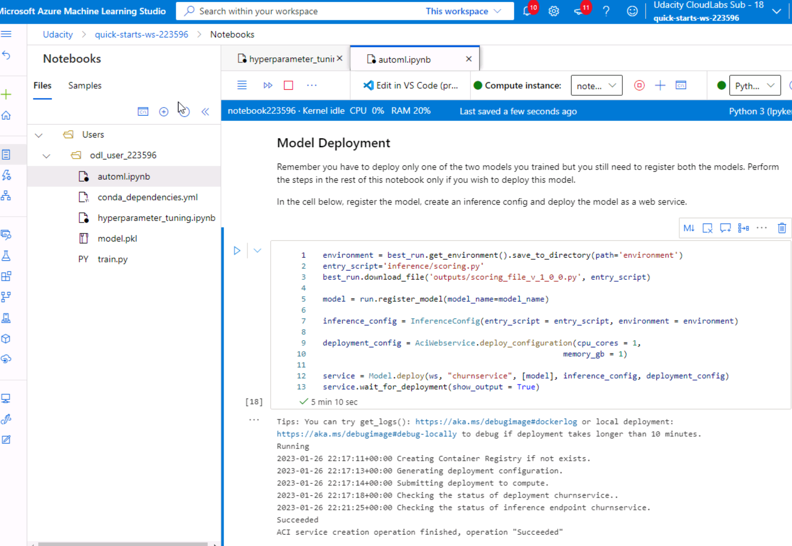
  
*Figure 14: Model endpoint*
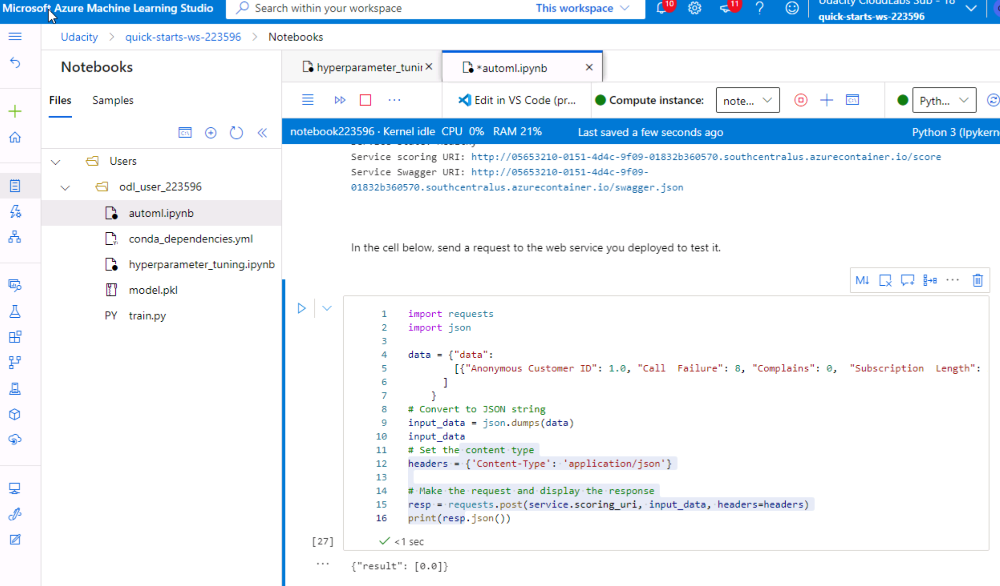
  
*Figure 15: Send a request to the endpoint*
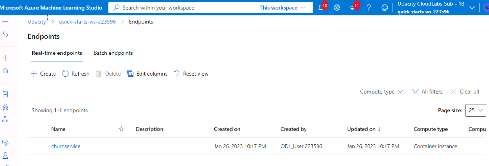
  
*Figure 16: Send a request to the endpoint*
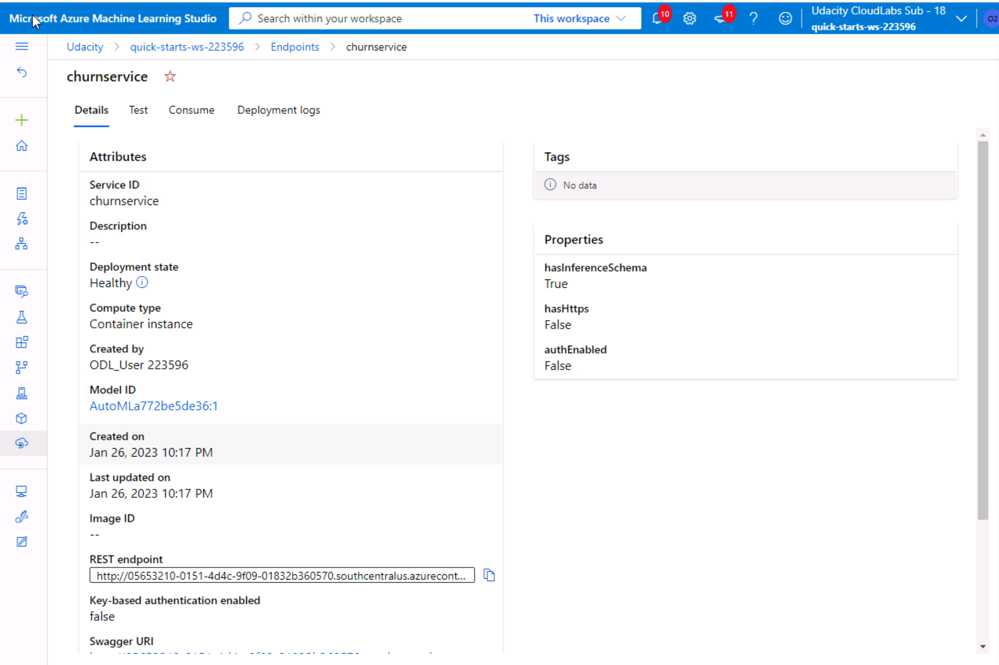
  

## Screen Recording
*TODO* Provide a link to a screen recording of the project in action. Remember that the screencast should demonstrate:
- A working model
- Demo of the deployed  model
- Demo of a sample request sent to the endpoint and its response

Link: <a href="https://www.youtube.com/watch?v=YXz6kT5-pSE" target="_blank">Screencast video</a>